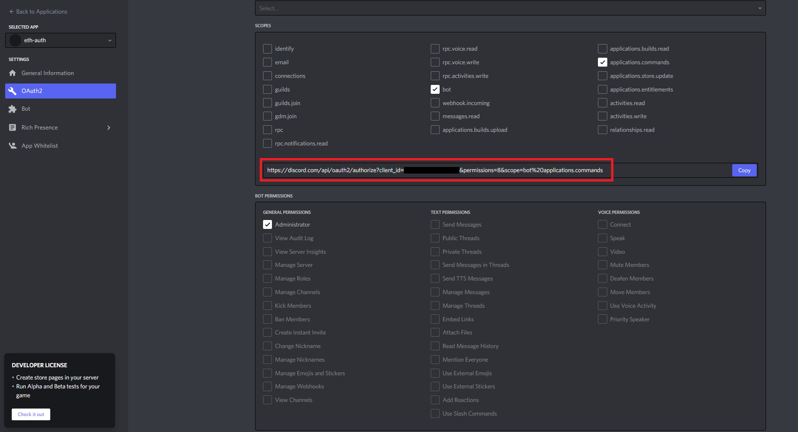

# Discord DAO Treasury Management

A tool to manage the Treasury of a DAO through Discord. The Treasury is managed using [Enzyme Finance](https://enzyme.finance/)'s vaults. The infrastructure is fully serverless and based on [AWS Lambda](https://aws.amazon.com/pt/lambda/).

This tool's capabilities are the following:
- Attribute a specific Discord role to users who have invested in the DAO's fund. This verification is done using [Ethereum Authentication through Discord](https://github.com/EsteFilipe/discord-ethereum-authentication) which I've built for a previous hackathon, but here with the added twist that the users only get authenticated if their address owns shares from the Enzyme vault in which the DAO's Treasury is stored.
- Once a user is assigned the investor role, they become able to call slash commands which give them information about the current state of the Treasury, such as the shares balances of all the other authenticated users.
- Upon authentication, if the address corresponds to that of the owner of the vault (the Treasury manager), the user also gets assigned the manager role on Discord, which enables them to call slash commands to start polls to decide what the DAO's Treasury funds should be allocated to. Only the authenticated investors can vote on these polls and the more shares an investor owns, the more weight their vote has.
- Upon poll expiration, case the result of the poll was to go through with a certain trade, the execution of the trade through the Enzyme vault is triggered.

Donations
========
If you find this repository useful, any ETH, NFT, or other tokens are greatly appreciated.
ETH Address: `0xa8624937a437F53382d4B48f1AE13E0CF5C9F8cB`

Contents
========
 * [Requirements](#prerequisites)
 * [Setup](#setup)
 * [Usage](#usage)
 * [Future improvements](#future-improvements)

### Prerequisites
---

- An Enzyme Finance vault
- A Discord account and a server where you're an administrator
- AWS Account with console and programmatic access
- A domain name registered with AWS
- Local AWS credentials profile
- Node version 14
- [SAM CLI](https://docs.aws.amazon.com/serverless-application-model/latest/developerguide/serverless-sam-cli-install.html)

### Setup
---
##### Enzyme Vault
- Create a vault on Enzyme (on Kovan Network).

##### Discord
- Create a Discord server if you don't have one already. Create the roles you want to give the users after they've authenticated with Ethereum. I named my roles _manager_ and _investor_. _manager_ will be assigned to the address of the owner of the vault and _investor_ will be assigned to any address that owns shares from the vault.
- [Set up an application for your bot](https://discordjs.guide/preparations/setting-up-a-bot-application.html#creating-your-bot)
- Select the following boxes in the OAuth2 tab. Open the link marked in red and choose your server to add the bot.

##### AWS

###### IAM User Credentials
- Create an access key pair for your AWS user as explained [here](https://www.youtube.com/watch?v=JvtmmS9_tfU) (this user must have administrator access).
- Create file `.aws/credentials` with the same structure as `.aws/credentials.example` (including the "[scaffold-eth]" part), and fill in the parameters `aws_access_key_id` and `aws_secret_access_key` with the values you obtained from the previous step.

###### Certificate for the API endpoint

- Create a certificate in [Certificate Manager](https://aws.amazon.com/pt/certificate-manager/) for the API endpoint you'll later deploy to be linked to. For instance, mine is at dev.api.vorder.io. Don't forget to add the DNS record to your domain as mentioned in the verification prompt that shows up once you create the certificate. You won't be able to deploy the __Ethereum Authentication Infrastructure__ correctly without the certificate Status showing up as _Issued_, so wait for it to complete before doing that part.

###### Secrets Manager
All the secrets necessary for the bot to run are retrieved from an [AWS Secrets Manager](https://aws.amazon.com/secrets-manager/) secret named `/dev/discord_dao_treasury_bot/discord` you have to create that secret manually before deploying the stack. When creating the secret choose the option _Other type of secrets_.

The secret must contain the following key/value pairs:
- `app_id`, from the application you've created in the Discord Setup.
- `public_key`, from the application you've created in the Discord Setup.
- `bot_token`, from the application you've created in the Discord Setup.
- `server_id`- Right-click your server on Discord and select __Copy ID__ to get this.
- `channel_id`. Right-click your channel on Discord and select __Copy ID__ to get this.
- `owner_role_id`. Right-click the _manager_ role you've created in the Discord setup and select __Copy ID__ to get this. You can see your server's roles by right-clicking your server > __Server Settings__ > __Roles__.
- `investor_role_id`. Same as for `owner_role_id` but now for the _investor_ role.
- `jwt_secret`. This is the secret which will be used to encode/decode the authentication JWTs. Anything works here, but choose something strong enough.
- `vault_address`. The address of the Enzyme vault you've created above.
- `ethereum_node_endpoint`. The URL for an Alchemy/Infura node endpoint.
- `vault_owner_eth_private_key`. The private key of the address that owns the Enzyme vault.

##### Discord Interaction Infrastructure
We'll now go through the deployment of the infrastructure responsible for interacting with Discord. This includes creating the slash-command and handling the role assignment when a user is successfuly authenticated. 

- `cd` into _packages/discord-interaction/src/commands_layer/nodejs_ and install the layer dependencies using `npm install`.
- `cd` back into _packages/discord-interaction/_ and do `sam build`. Once the build is complete do `sam deploy --guided` and choose the following parameters:

    > Stack Name [dev-discord-interaction]: dev-discord-interaction

    > AWS Region [us-east-2]: us-east-2

    > #Shows you resources changes to be deployed and require a 'Y' to initiate deploy

    > Confirm changes before deploy [y/N]: n

    > #SAM needs permission to be able to create roles to connect to the resources in your template

    > Allow SAM CLI IAM role creation [Y/n]: y

    > DiscordHandlerFunction may not have authorization defined, Is this okay? [y/N]: y

    > Save arguments to configuration file [Y/n]: y

    > SAM configuration file [samconfig.toml]: samconfig.toml

    > SAM configuration environment [default]: default

- Once the deployment is complete copy the __API Gateway endpoint URL__ stack output and paste it in the Discord Developer Portal as __Interactions Endpoint URL__.  If Discord was able to successfuly ping our Lambda you'll get a message saying "_All your edits have been carefully recorded_" at the top of the screen.
- Check that you now have a stack called _dev-discord-interaction_ in Cloudformation. Cross your fingers 🤞 and call the command `/eth-auth` in your Discord channel. If everything went right with the deploy, the bot should respond with a URL.

##### Enzyme Interaction Infrastructure
This deployment is quite similar to the one for the Discord Interaction Infrastructure:

- `cd` into _packages/enzyme-interaction/src/dependencies_layer/nodejs_ and install the layer dependencies using `npm install`.
- `cd` back into _packages/enzyme-interaction/_ and do `sam build`. Once the build is complete do `sam deploy --guided` and choose the following parameters:

    > Stack Name [dev-enzyme-interaction]: dev-enzyme-interaction

    > AWS Region [us-east-2]: us-east-2

    > #Shows you resources changes to be deployed and require a 'Y' to initiate deploy

    > Confirm changes before deploy [y/N]: n

    > #SAM needs permission to be able to create roles to connect to the resources in your template

    > Allow SAM CLI IAM role creation [Y/n]: y

    > DiscordHandlerFunction may not have authorization defined, Is this okay? [y/N]: y

    > Save arguments to configuration file [Y/n]: y

    > SAM configuration file [samconfig.toml]: samconfig.toml

    > SAM configuration environment [default]: default

##### Ethereum Authentication Infrastructure
Now let's deploy the API that will talk to the front-end and handle the Ethereum authentication flow.

- In the root folder run `yarn install`. You'll get quite a lot of warnings regarding workspace dependencies, but those are harmless. Note: All the packages for this infrastructure (and also for the front-end and the chain) are installed through `yarn` workspaces. The __api__ package dependencies will later be installed using `npm`.

###### DynamoDB infrastructure
- `cd` into _packages/db-infrastructure_ and run `npm run deploy`. After this runs, you should now have a stack called _dev-scaffold-eth-infra-dynamodb_ in Cloudformation.

###### Authentication API infrastructure
- `cd` into _packages/api_ and install the dependencies using `npm install`.
- Change the URL that will be linked to your API in the following files - this is the same URL that you've created the Certificate above for, e.g. for me it's dev.api.vorder.io:
  1. In the file _packages/api/serverless.yml_, change the variable __domainName__ so that it matches your URL. __${self:custom.stage}__ is set to _dev_ by default already.
  2. In the file _packages/react-app/src/util_ change __baseUrl__ to that same URL so that the front-end knows where the API is located.
- Link your API to the URL by running `npx serverless create_domain`.
- Finally, deploy the infrastucture using `npm run deploy`. 

### Future Improvements
---
- Integrate on-chain voting using https://docs.openzeppelin.com/contracts/4.x/governance
- Push notifications every time an investor buys or sells shares